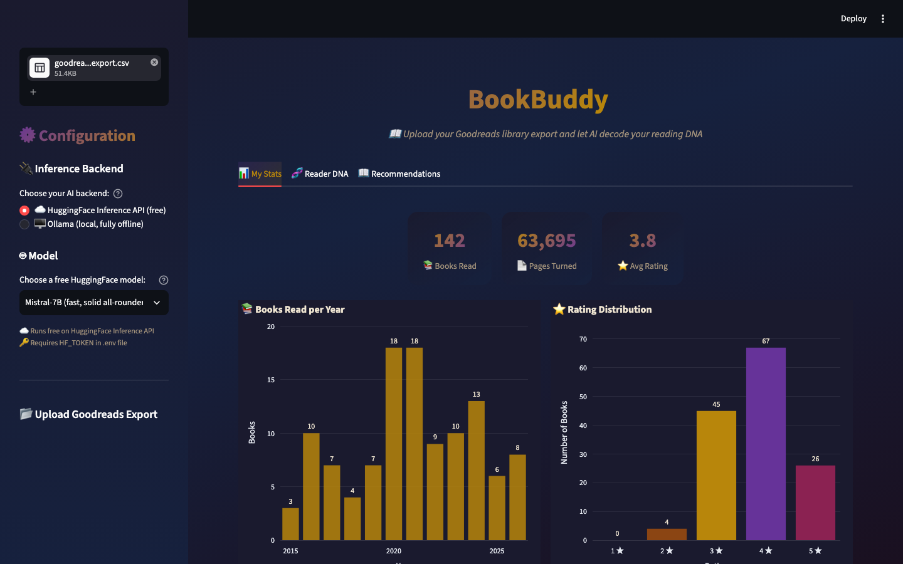
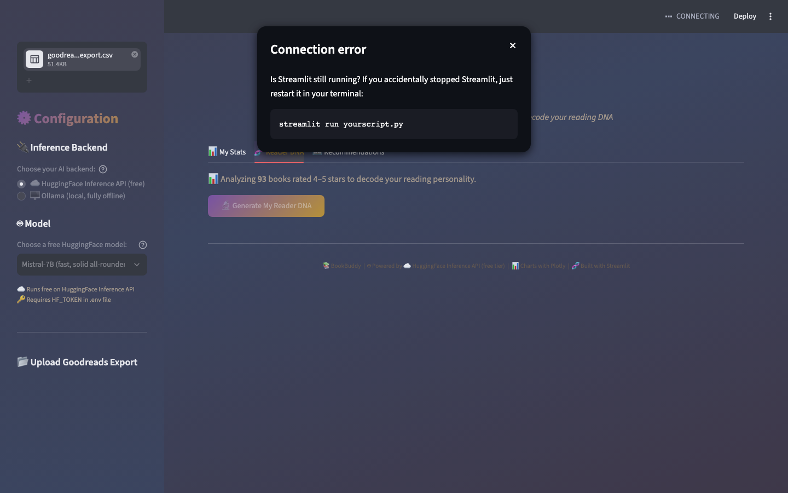
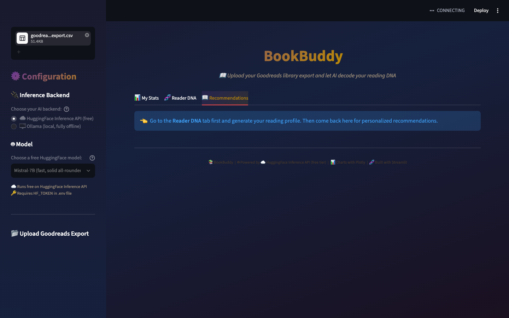
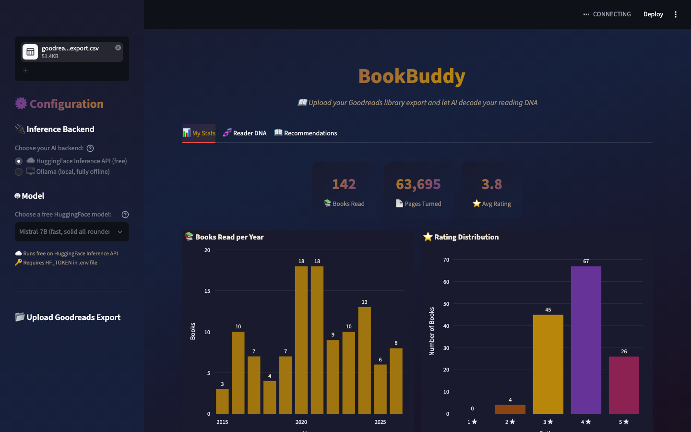

# 📚 BookBuddy

**AI-powered Goodreads reading history analyzer — decode your literary DNA.**

Upload your Goodreads library export and BookBuddy will:
- 📊 **Visualize your reading stats** — books per year, rating distribution, top authors, genre breakdown
- 🧬 **Generate your Reader DNA** — a 150-word AI profile of your reading personality
- 📖 **Recommend 5 new books** — tailored to your specific taste, with personalized explanations

<p align="center">
  
  
</p>

<p align="center">
  
  
</p>

---

## 🚀 Quick Start

### 1. Export your Goodreads library
1. Log into [Goodreads](https://www.goodreads.com)
2. Go to **My Books** (the "Browse" dropdown → "My Books" in the old nav, or the My Books tab)
3. Find the **Tools** panel on the left sidebar → click **Import/Export**
4. Click **Export Library** — Goodreads will prepare a CSV and email you a download link within a few minutes
5. Download the CSV file (usually named `goodreads_library_export.csv`)

> 📝 **Note:** If the Import/Export link is not visible, go directly to:  
> `https://www.goodreads.com/review/import`

### 2. Install dependencies
```bash
git clone https://github.com/SubhajitG87/BookBuddy.git
cd BookBuddy
python -m venv .venv && source .venv/bin/activate   # or `uv venv`
pip install -r requirements.txt
```

### 3. Get a HuggingFace token (free — takes 30 seconds)
Visit [huggingface.co/settings/tokens](https://huggingface.co/settings/tokens) → click **Create new token** → choose *Read* scope → copy the `hf_...` string.

> 💡 **No credit card, no paid plan.** The HuggingFace Inference API *free tier* is sufficient for BookBuddy's short prompts.

### 4. Configure
```bash
cp .env.example .env
# Open .env and paste your token:
#   HF_TOKEN=hf_yourActualTokenHere
```

### 5. Launch
```bash
streamlit run app.py
```

Open `http://localhost:8501`, upload your Goodreads CSV in the sidebar, and explore your stats. Click **Generate My Reader DNA** — in ~10 seconds you'll have your literary profile. Then hop to the Recommendations tab for personalized picks.

---

## 🤖 AI Backend

BookBuddy offers **two** inference backends (choose in sidebar):

### ☁️ Option A — HuggingFace Inference API (default)
Free-tier models — select in the sidebar. No GPU, no downloads, no cost:

| Model | Description |
|-------|-------------|
| **Mistral-7B** | Fast, solid all-rounder |
| **Llama-3.1-8B** | Meta's flagship open model |
| **Gemma-2-9B** | Google's lightweight model |

> ⚡ **Runs free on the HuggingFace Inference API free tier.** Only a `HF_TOKEN` is required (free to create).

### 🖥️ Option B — Ollama (fully offline)
Run completely on your machine — zero external API calls, zero cost, total privacy:

```bash
# Install Ollama (macOS/Linux/Windows): https://ollama.com
ollama pull mistral     # 4.1 GB one-time download
pip install ollama      # Python client library
```

Then switch the sidebar radio to **Ollama** and select `Mistral (local)`. The app detects whether `ollama` is installed and guides you if it isn't.

> 🔒 **Runs fully offline with Ollama.** No internet needed after the initial model pull.

---

## 🌐 Deploy on the Web (free)

You can run BookBuddy in your browser — no local setup needed:

**[](https://bookbuddy.streamlit.app)**
&nbsp;&nbsp;&nbsp;
**[](https://huggingface.co/spaces/SubhajitG87/BookBuddy)**

Both deployments use the HuggingFace Inference API free tier. Upload your CSV, choose a model, and get your Reader DNA — all from your browser.

---

## 🧬 Sample Reader DNA

Here's what BookBuddy might say about a reader who devours epic fantasy, speculative thrillers, and literary fiction:

> *You're a reader who craves epic scope with intimate character work — the kind where a 700-page fantasy novel feels like a conversation with an old friend. You gravitate toward morally complex protagonists in richly built worlds (Gwynne, Abercrombie, Jemisin), but you'll equally devour a tight speculative thriller (Crouch, Weir) or literary fiction that plays with structure (Doerr, Zevin). Your 5-star shelf reveals a hunger for narratives that respect your intelligence: layered magic systems that feel earned, prose that sings without showing off, and endings that linger. You don't just read for plot — you read for voice, for the particular alchemy of an author who makes the impossible feel inevitable.*

---

## 📊 Features

### Tab 1 — My Stats (no AI)
- 📚 Books read per year (bar chart)
- ⭐ Rating distribution (histogram)
- ✍️ Top 10 authors by book count
- 🎨 Genre breakdown (pie chart, inferred from shelves+reviews)
- 📄 Total pages read

All charts powered by **Plotly** with a dark Goodreads+Claude gradient theme.

### Tab 2 — Reader DNA (AI-powered)
Filters your 4–5 star books and sends them to the LLM. The AI writes a 150-word paragraph profiling your reading personality — what themes you gravitate toward, what writing styles you love, what you seek in a book.

### Tab 3 — Recommendations (AI-powered)
Uses your Reader DNA + full reading history to recommend 5 books you haven't read but would love. Each recommendation comes with a 2-sentence reason tied to your specific taste. **Download everything as a Markdown file.**

---

## 📁 Project Structure

```
BookBuddy/
├── app.py                 # Streamlit entry point (tabs, sidebar, orchestration)
├── requirements.txt       # Python dependencies (all MIT/Apache-2.0)
├── pyproject.toml         # Project metadata & build config
├── Makefile               # Dev shortcuts: lint, test, screenshots
├── .env.example           # HF_TOKEN template
├── README.md
├── LICENSE                # MIT License
├── docs/
│   └── screenshots/       # README screenshots & sample CSV
├── scripts/
│   └── capture_screenshots.py  # Playwright screenshot automation
└── src/
    ├── __init__.py
    ├── llm_client.py      # HF Inference API + Ollama abstraction
    ├── data_processor.py  # CSV parsing, stats computation, genre inference
    ├── charts.py          # Plotly visualizations (Goodreads dark theme)
    ├── prompts.py         # AI prompt templates (Reader DNA + Recommendations)
    ├── ui_components.py   # Styled cards, sidebar builder, Markdown export
    ├── exceptions.py      # Custom exception hierarchy
    ├── types.py           # TypedDict data structures
    └── logging_config.py  # Structured logging setup
```

---

## 📦 Dependencies

| Package | Purpose | License |
|---------|---------|---------|
| streamlit | Web UI framework | Apache 2.0 |
| pandas | CSV parsing & data wrangling | BSD 3-Clause |
| plotly | Interactive charts (bar, pie, histogram) | MIT |
| huggingface_hub | HuggingFace Inference API client | MIT |
| ollama (optional) | Local LLM client for offline mode | MIT |
| python-dotenv | `.env` file parsing | MIT |

All dependencies are MIT or Apache 2.0 licensed.

---

## 🔧 Requirements

- Python 3.10+
- HuggingFace API token (free tier) — for Option A
- Or [Ollama](https://ollama.com) installed locally — for Option B
- Goodreads CSV export (see Quick Start step 1)

---

## 📝 License

MIT © 2026 Subhajit Ganguly — use freely, modify, and share.

---

*Built with ❤️ using Streamlit, Plotly, and HuggingFace AI*